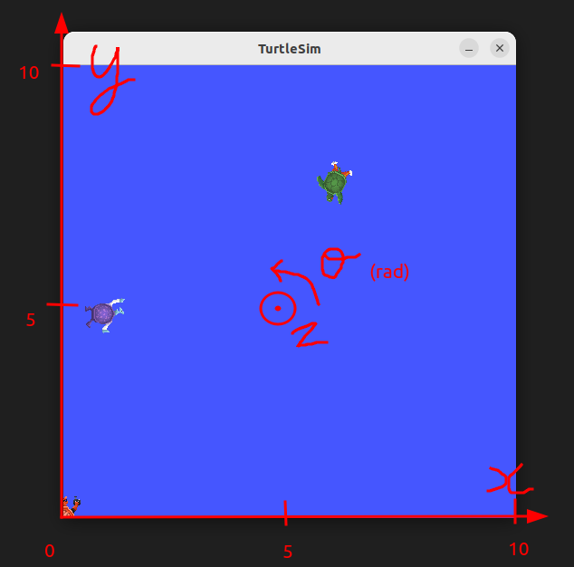

# Turtlesim playground

## Run Turtlesim

Let's run Turtlesim with the teleop node.
In a terminal:

```sh
ros2 run turtlesim turtlesim_node
```

In another terminal:

```sh
ros2 run turtlesim turtle_teleop_key
```

<figure style="text-align: center;">
    
    <figcaption>turtlesim_node: X,Y,theta</figcaption>
</figure>

## Messages

The velocity command topic `/turtle1/cmd_vel` uses `geometry_msgs/msg/Twist`.

```sh
ros2 topic type /turtle1/cmd_vel
ros2 interface show geometry_msgs/msg/Twist
```

## Services

```sh
ros2 service list
```

There are 7 services:

- /clear
- /kill
- /reset
- /spawn
- /turtle1/set_pen
- /turtle1/teleport_absolute
- /turtle1/teleport_relative

### Service /clear

```sh
$ ros2 service type /clear
std_srvs/srv/Empty
$ ros2 interface show std_srvs/srv/Empty
---
```

The request should be put inside quote and curly brackets.
Therefore the service call is:

```sh
ros2 service call /clear std_srvs/srv/Empty "{}"
```

### Service /spawn

```sh
$ ros2 service type /spawn
turtlesim/srv/Spawn
$ ros2 interface show turtlesim/srv/Spawn
float32 x
float32 y
float32 theta
string name # Optional.  A unique name will be created and returned if this is empty
---
string name
```

Therefore the service call is

```sh
ros2 service call /spawn turtlesim/srv/Spawn "{x: 1.0, y: 5.0, theta: 0.0, name: 'TurtleSpawned'}"
```

### Service /kill

```sh
$ ros2 service type /kill
turtlesim/srv/Kill
$ ros2 interface show turtlesim/srv/Kill
string name
---
$ ros2 service call /kill turtlesim/srv/Kill "{name: 'TurtleSpawned'}"
requester: making request: turtlesim.srv.Kill_Request(name='TurtleSpawned')

response:
turtlesim.srv.Kill_Response()
```

## Params

### /background_r, /background_g, /background_b

```sh
ros2 param list
```

```sh
ros2 param get /turtlesim background_r
```

```sh
ros2 run turtlesim turtlesim_node --ros-args -p background_b:=0 -p background_g:=200
```

We have services to interact with the parameter function.

```sh
ros2 service type /turtlesim/list_parameters
ros2 interface show rcl_interfaces/srv/ListParameters
```

Then request the service:

```sh
ros2 service call /turtlesim/list_parameters rcl_interfaces/srv/ListParameters "{prefixes: [], depth: 0}"
```

That does the same as `ros2 param list`.
