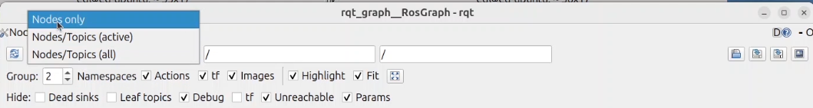
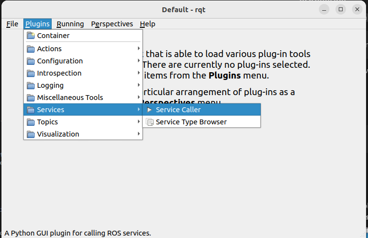
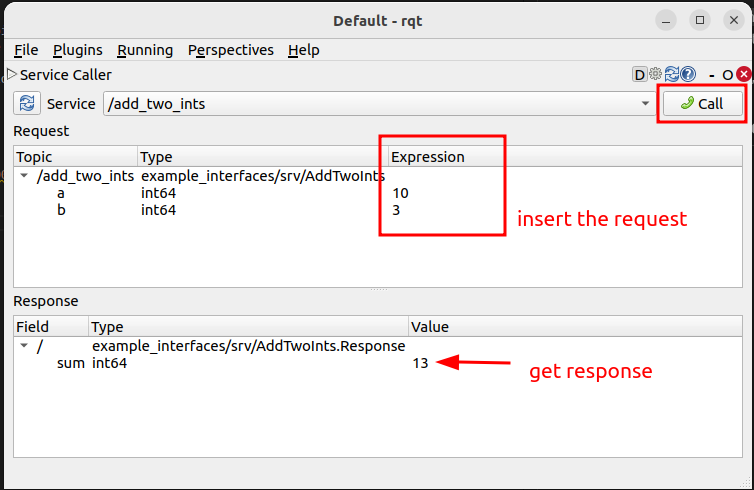

# ROS 2 Tools: `rqt` and `rqt_graph`

## Overview

This is an introduction to two essential ROS 2 tools: `rqt` and `rqt_graph`. These tools are part of the ROS 2 ecosystem and are used for visualizing and managing various aspects of your ROS 2 system.

- [ROS 2 `rqt` Documentation](https://index.ros.org/doc/ros2/Tutorials/rqt/)
- [ROS 2 `rqt_graph` Documentation](https://index.ros.org/doc/ros2/Tutorials/rqt_graph/)

## `rqt`

`rqt` is a Qt-based framework for GUI development in ROS 2. It provides a collection of plugins for different purposes, such as monitoring topics, visualizing data, and managing nodes. Some of the key features of `rqt` include:

- **Plugin-based architecture**: Easily extendable with custom plugins.
- **Visualization**: View and interact with ROS 2 topics, services, and parameters.
- **Diagnostics**: Monitor the health and performance of your ROS 2 system.

### Installation.png

To install `rqt`, use the following command:

```bash
sudo apt-get install ros-<distro>-rqt
```

Replace `<distro>` with your ROS 2 distribution (e.g., `foxy`, `galactic`).

### Usage

To start `rqt`, simply run:

```bash
rqt
```

## rqt_graph

`rqt_graph` is a plugin for `rqt` that provides a graphical representation of the ROS 2 computation graph. It visualizes the nodes and the topics they publish or subscribe to, making it easier to understand the interactions within your ROS 2 system.

### Installation

To install `rqt_graph`, use the following command:

```bash
sudo apt-get install ros-<distro>-rqt-graph
```

Replace `<distro>` with your ROS 2 distribution.

### Usage

To start `rqt_graph`, run:

```bash
rqt_graph
```

Alternatively, you can launch `rqt` and select the `rqt_graph` plugin from the Plugins menu.

### Tips

- **Adjusting Graph Layout**: You can rearrange the nodes in the graph by dragging them around.
- **Filtering Nodes**: Use the search bar to filter nodes based on their names.

<figure style="text-align: center;">
    
    <figcaption>rqt_graph: select nodes only</figcaption>
</figure>


## Conclusion

`rqt` and `rqt_graph` are powerful tools that enhance your ability to develop, debug, and manage ROS 2 systems. By leveraging these tools, you can gain better insights into the behavior and performance of your robotic applications.

For more information, refer to the official ROS 2 documentation and tutorials.


## Plugin: Service Call

<figure style="text-align: center;">
    
    <figcaption>rqt Plugin: Service call</figcaption>
</figure>


<figure style="text-align: center;">
    
    <figcaption>Service call: send request and retrieve response</figcaption>
</figure>
